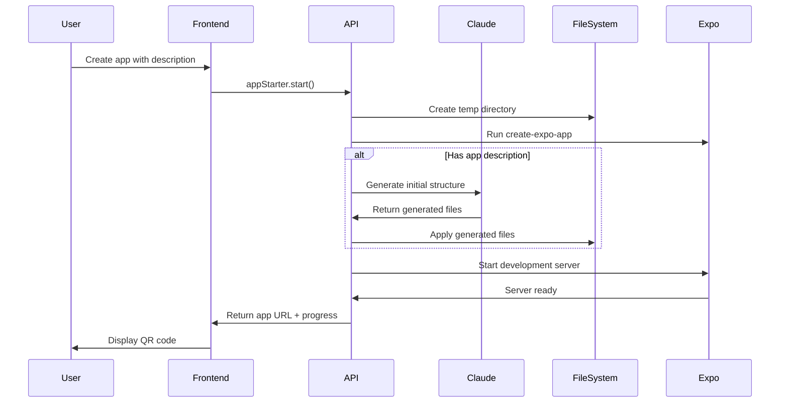
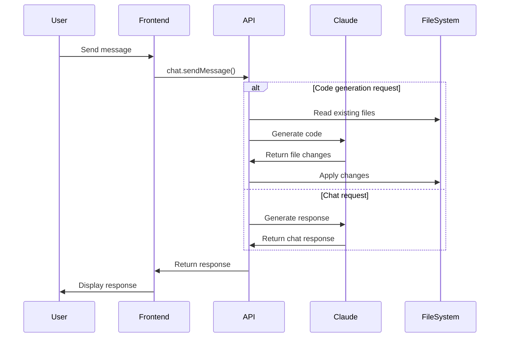

# System Architecture

## Overview

PromptFuel uses a modern full-stack architecture built on the T3 stack with Claude AI integration for code generation.

## Technology Stack

### Frontend
- **Next.js 15**: React framework with App Router
- **React 19**: UI library with latest features
- **Tailwind CSS**: Utility-first CSS framework
- **tRPC**: Type-safe API client

### Backend
- **Next.js API Routes**: Serverless API endpoints
- **tRPC**: Type-safe API layer
- **Prisma**: Database ORM
- **PostgreSQL**: Primary database

### AI Integration
- **Claude API**: Code generation and chat responses
- **Anthropic SDK**: Official TypeScript SDK

### Mobile Development
- **Expo**: React Native framework
- **Expo CLI**: Development tooling

## Core Components

### 1. User Interface Layer

#### Home Page (`src/app/page.tsx`)
- App creation form with optional description
- Session ID generation
- Routing to chat interface

#### Chat Interface (`src/app/chat/page.tsx`)
- Real-time chat with Claude
- Build progress display
- QR code generation for Expo Go
- Polling-based updates

### 2. API Layer

#### tRPC Routers (`src/server/api/routers/`)

**App Starter Router** (`appStarter.ts`)
- `start`: Creates Expo projects with optional custom structure
- `getProgress`: Returns build progress for polling

**Chat Router** (`chat.ts`)
- `sendMessage`: Processes user messages and generates responses
- Detects code vs. chat requests
- Integrates with Claude for AI responses

### 3. AI Services Layer

#### Claude Service (`src/server/services/claude.ts`)
- **Code Generation**: Converts natural language to React Native code
- **Chat Responses**: Handles non-code conversations
- **Initial App Generation**: Creates custom app structures
- **Error Handling**: Rate limiting, retries, and error classification

#### File Manager (`src/server/services/fileManager.ts`)
- **File Operations**: Create, update, delete files safely
- **Security**: Path validation to prevent directory traversal
- **Project Management**: List and read existing project files
- **Backup/Restore**: File backup before modifications

### 4. Progress Tracking System

#### Build Progress Map
- In-memory storage for session progress
- Real-time updates via `updateBuildProgress()`
- Polling-based client updates (replaced SSE)

#### Progress States
```typescript
interface BuildProgress {
  stage: string;           // Current build stage
  message: string;         // Status message
  progress: number;        // 0-100 percentage
  isComplete: boolean;     // Build completion status
  hasError: boolean;       // Error state
  logs: string[];          // Build output logs
  expoUrl?: string;        // Generated app URL
  networkInfo?: NetworkInfo; // Network configuration
}
```

### 5. File System Integration

#### Temporary Project Directories
```
/tmp/expo-{sessionId}/
├── App.js              # Main app component
├── app.json           # Expo configuration
├── package.json       # Dependencies
├── components/        # Generated components
├── screens/          # Generated screens
└── assets/           # Static assets
```

#### File Operation Flow
1. **Security Check**: Validate file paths
2. **Backup**: Store current file contents
3. **Generate**: Create new code with Claude
4. **Apply**: Write files to project directory
5. **Verify**: Check operation success

### 6. Expo Integration

#### Project Creation Process
1. **Initialize**: Create temporary directory
2. **Generate**: Run `create-expo-app` command
3. **Customize**: Apply Claude-generated code (if description provided)
4. **Start Server**: Launch Expo development server
5. **Network Setup**: Configure for mobile access

#### Development Server Management
- **Process Tracking**: Monitor Expo server processes
- **Port Management**: Find available ports automatically
- **Network Detection**: Configure IP for mobile access
- **Cleanup**: Automatic cleanup on exit

## Data Flow

### App Creation Flow


### Chat Interaction Flow


## Security Considerations

### File System Security
- **Path Validation**: All file operations validated against project directory
- **Sandboxing**: Projects isolated in temporary directories
- **Input Sanitization**: User input sanitized before file operations

### API Security
- **Environment Variables**: Sensitive data in environment variables
- **Rate Limiting**: Claude API rate limit handling
- **Error Handling**: No sensitive information exposed in errors

### Process Management
- **Cleanup**: Automatic cleanup of temporary files and processes
- **Resource Limits**: Prevent resource exhaustion
- **Process Isolation**: Each session isolated

## Scalability Considerations

### Current Limitations
- **In-memory storage**: Progress tracking not persistent
- **Single server**: No horizontal scaling
- **Temporary files**: Not suitable for production persistence

### Future Improvements
- **Redis**: For progress tracking and session management
- **Database**: Persistent project storage
- **Container**: Docker for process isolation
- **Load Balancer**: Multiple server instances