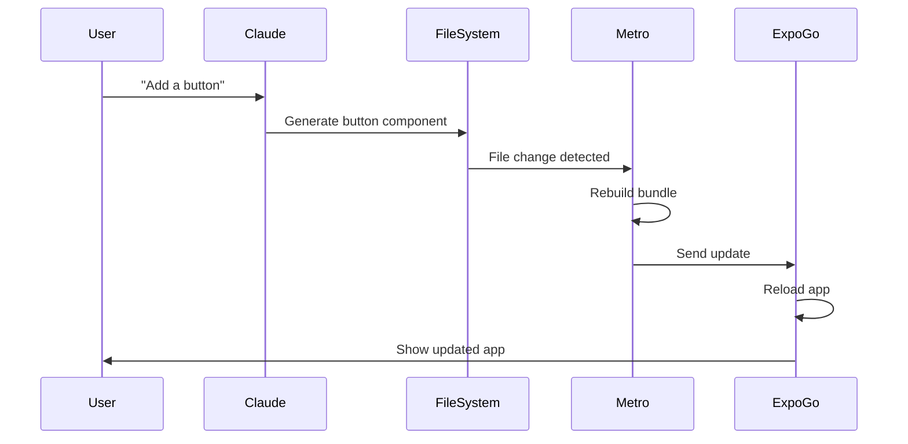

# Expo Integration

This document explains how PromptFuel integrates with Expo for mobile app development and testing.

## Overview

PromptFuel automatically creates and manages Expo projects, allowing users to see their AI-generated apps running on mobile devices in real-time through Expo Go.

## Expo Project Creation

### Project Initialization

The system creates new Expo projects using the official CLI:

```typescript
// Primary method
await runCmd(
  "npx",
  ["create-expo-app", ".", "--template", "blank", "--yes"],
  projectDir,
  sessionId,
  "Creating Expo template"
);

// Fallback method
await runCmd(
  "npx", 
  ["create-expo-app", ".", "--yes"],
  projectDir,
  sessionId,
  "Installing Expo template (retry)"
);
```

### Project Structure

Generated projects follow standard Expo structure:

```
/tmp/expo-{sessionId}/
├── App.js                 # Main app entry point
├── app.json              # Expo configuration
├── package.json          # Dependencies and scripts
├── babel.config.js       # Babel configuration
├── metro.config.js       # Metro bundler config
├── components/           # AI-generated components
├── screens/              # App screens
├── assets/               # Static assets
│   ├── icon.png
│   ├── splash-icon.png
│   └── adaptive-icon.png
└── node_modules/         # Dependencies
```

### Configuration

#### app.json
```json
{
  "expo": {
    "name": "expo-{sessionId}",
    "slug": "expo-{sessionId}",
    "version": "1.0.0",
    "orientation": "portrait",
    "icon": "./assets/icon.png",
    "userInterfaceStyle": "light",
    "newArchEnabled": true,
    "splash": {
      "image": "./assets/splash-icon.png",
      "resizeMode": "contain",
      "backgroundColor": "#ffffff"
    },
    "ios": {
      "supportsTablet": true
    },
    "android": {
      "adaptiveIcon": {
        "foregroundImage": "./assets/adaptive-icon.png",
        "backgroundColor": "#ffffff"
      },
      "edgeToEdgeEnabled": true
    },
    "web": {
      "favicon": "./assets/favicon.png"
    }
  }
}
```

## Development Server Management

### Server Startup

Expo development servers are started automatically:

```typescript
async function startExpoServer(
  projectDir: string,
  port: number,
  sessionId: string
): Promise<{ process: any; url: string }> {
  
  const expoProcess = spawn(
    "npx",
    [
      "expo",
      "start",
      "--port", port.toString(),
      "--clear",
      "--lan",
    ],
    {
      cwd: projectDir,
      stdio: ["ignore", "pipe", "pipe"],
      detached: false,
      env: {
        ...process.env,
        CI: "1", // Use CI mode instead of --non-interactive
        EXPO_FORCE_PORT: port.toString(),
        PWD: projectDir,
      },
    }
  );
  
  return { process: expoProcess, url: networkInfo.url };
}
```

### Port Management

Dynamic port allocation ensures no conflicts:

```typescript
// Find available port starting from 8081
const expoPort = await findAvailablePort(8081);

export async function findAvailablePort(startPort: number): Promise<number> {
  for (let port = startPort; port < startPort + 100; port++) {
    if (await isPortAvailable(port)) {
      return port;
    }
  }
  throw new Error("No available ports found");
}
```

### Process Management

Server processes are tracked and managed:

```typescript
// Register process with manager
processManager.registerProcess(sessionId, expoProcess, "expo", {
  port: expoPort,
  projectPath: projectDir,
});

// Automatic cleanup on exit
expoProcess.on("exit", (code) => {
  console.log(`[ExpoServer] Process exited with code ${code}`);
  rm(projectDir, { recursive: true, force: true }).catch(console.error);
});
```

## Network Configuration

### IP Detection

The system automatically detects the best IP for mobile access:

```typescript
export async function getNetworkInfo(port: number) {
  const interfaces = networkInterfaces();
  
  // Priority order for network interfaces
  const priorities = ['en0', 'eth0', 'wlan0', 'WiFi'];
  
  for (const name of priorities) {
    const iface = interfaces[name];
    if (iface) {
      for (const details of iface) {
        if (details.family === 'IPv4' && !details.internal) {
          return {
            ip: details.address,
            port,
            url: `exp://${details.address}:${port}`,
            isValidForMobile: true
          };
        }
      }
    }
  }
  
  // Fallback to localhost
  return {
    ip: "127.0.0.1",
    port,
    url: `exp://127.0.0.1:${port}`,
    isValidForMobile: false
  };
}
```

### Mobile Connectivity

**Network Requirements:**
- Device and development machine on same WiFi network
- Port accessible (not blocked by firewall)
- Valid network interface detected

**Troubleshooting:**
- Check firewall settings
- Verify WiFi connection
- Try different network interfaces
- Use localhost for same-machine testing

## QR Code Generation

### QR Code Creation

Automatic QR code generation for Expo Go:

```typescript
const generateQRCode = async (expoUrl?: string) => {
  try {
    const url = expoUrl || buildProgress.expoUrl || "exp://localhost:8081";
    
    const qrUrl = await QRCode.toDataURL(url, {
      width: 256,
      margin: 2,
      color: { dark: "#000000", light: "#FFFFFF" },
    });
    
    setQrCodeUrl(qrUrl);
  } catch (error) {
    console.error("Error generating QR code:", error);
  }
};
```

### QR Code Display

The chat interface displays QR codes with instructions:

```tsx
{qrCodeUrl ? (
  <div className="space-y-4">
    <div className="inline-block rounded-xl border border-gray-200 bg-white p-4">
      
    </div>
    
    <div className="space-y-2 text-gray-600 text-sm">
      <p className="font-medium">📱 Scan with Expo Go</p>
      <p>1. Install Expo Go from your app store</p>
      <p>2. Open Expo Go and scan this QR code</p>
      <p>3. Your app will load instantly!</p>
    </div>
  </div>
) : (
  <div className="mx-auto flex h-48 w-48 items-center justify-center">
    <div className="text-gray-500">Generating QR code...</div>
  </div>
)}
```

## Real-time Updates

### Hot Reloading

Expo automatically detects file changes:

1. **File Modified**: Claude generates new code
2. **File Written**: Code applied to project directory
3. **Metro Detects**: Metro bundler detects file changes
4. **Bundle Update**: New bundle generated
5. **Device Update**: Expo Go receives update
6. **App Reload**: App reloads with new code

### Update Flow



## Expo Go Integration

### App Loading

Users load apps through Expo Go:

1. **Install Expo Go**: Download from app store
2. **Scan QR Code**: Use in-app QR scanner
3. **Load App**: Expo Go downloads and runs bundle
4. **Live Updates**: Automatic updates as code changes

### Platform Support

**iOS:**
- Expo Go from App Store
- iOS 13.0 or later
- Camera permission for QR scanning

**Android:**
- Expo Go from Google Play
- Android 5.0 or later
- Camera permission for QR scanning

### Debugging

Expo Go provides debugging capabilities:

- **Error Overlay**: Runtime errors displayed in app
- **Console Logs**: Available in Expo Go developer menu
- **Performance Monitor**: Built-in performance metrics
- **Element Inspector**: Component inspection tools

## SDK Compatibility

### Expo SDK Version

PromptFuel uses Expo SDK 53.0.0:

```json
{
  "dependencies": {
    "expo": "~53.0.0",
    "react": "18.3.1",
    "react-native": "0.76.5"
  }
}
```

### Supported APIs

Claude generates code using supported Expo APIs:

**Core APIs:**
- Navigation (React Navigation)
- Storage (AsyncStorage)
- Camera (expo-camera)
- Location (expo-location)
- Notifications (expo-notifications)

**UI Components:**
- React Native core components
- Expo UI components
- Custom styled components

**Third-party Libraries:**
- Vector Icons
- Linear Gradient
- Date/Time Picker
- Maps integration

## Error Handling

### Common Issues

**Port Conflicts:**
```
Error: Port 8081 is already in use
```
- Solution: Automatic port finding
- Alternative ports: 8082, 8083, etc.

**Network Issues:**
```
Error: Could not connect to development server
```
- Check WiFi connection
- Verify firewall settings
- Try localhost fallback

**Build Failures:**
```
Error: Metro bundler failed to start
```
- Clean cache with `--clear` flag
- Check project structure
- Verify dependencies

### Recovery Mechanisms

**Automatic Retry:**
- Command failures trigger automatic retry
- Alternative installation methods
- Port conflict resolution

**Manual Recovery:**
- User can refresh page to restart
- Clean project directory recreation
- Process cleanup and restart

## Performance Optimization

### Bundle Size

Metro bundler optimizations:
- Tree shaking for unused code
- Minification in production
- Asset optimization

### Startup Time

Fast app loading:
- Minimal initial bundle
- Lazy loading of components
- Optimized asset loading

### Memory Usage

Efficient resource usage:
- Automatic cleanup of unused projects
- Process monitoring and limits
- Memory leak prevention

## Future Enhancements

### EAS Integration

Planned integration with Expo Application Services:

- **EAS Build**: Cloud-based builds
- **EAS Submit**: App store submissions
- **EAS Update**: Over-the-air updates

### Custom Development Builds

Support for custom native code:

- **Development Builds**: Custom Expo Go with native modules
- **Native Modules**: Integration with custom native code
- **Third-party Libraries**: Extended library support

### Testing Integration

Automated testing capabilities:

- **Detox**: End-to-end testing
- **Jest**: Unit testing
- **Storybook**: Component testing